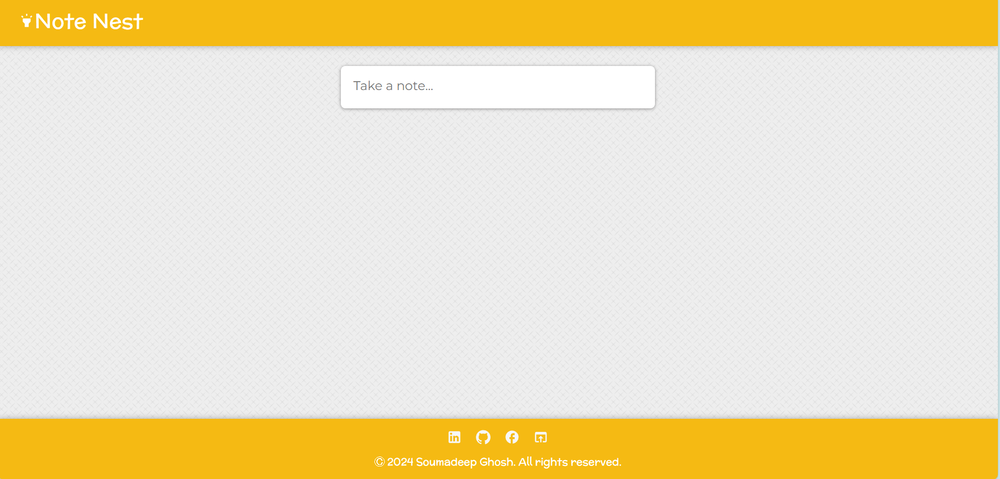

# Note Nest- Formate your notes 




## Installation Guide

### Requirements
- [Nodejs](https://nodejs.org/en/download)
- [React](https://react.dev/)

Node should be installed 
### Installation
git clone https://github.com/SoumadeepGhosh/Note-Nest.git
cd Note-Nest
```


Now install the dependencies
```shell
cd Note-Nest
yarn or npm install

We are almost done, Now just start the development server.

```shell
cd Note-Nest
yarn or npm start
```
Done! Now open localhost:5173 in your browser.
